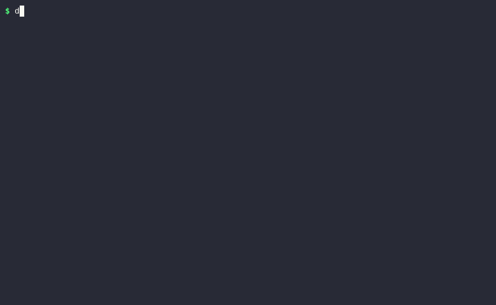

# dochist

[](https://github.com/motroy/dochist/actions/workflows/ci.yml)
[](https://github.com/motroy/dochist/releases)
[](LICENSE)

**dochist** is a session-based command history and artifact provenance logger, written in Rust. It records every command you run through it into a named session, tracks the files each command creates or modifies (with SHA-256 checksums), and renders the whole session as a [FAIR](https://www.go-fair.org/fair-principles/) compliance document. Sessions are plain JSON and can be saved and reloaded, so work can be paused and continued — even on a different machine.

Typical use case: documenting a data-analysis or bioinformatics pipeline as you build it, so that at the end you have an auditable, reproducible record of exactly what was run, in what order, and which outputs each step produced.



*(recorded with [asciinema](https://asciinema.org) + [agg](https://github.com/asciinema/agg); raw, replayable recording at [`demo/dochist-demo.cast`](demo/dochist-demo.cast) — play it locally with `asciinema play demo/dochist-demo.cast`. See [`demo/README.md`](demo/README.md) for how it's put together / re-recorded.)*

## Install

### Linux (no Rust required)

Run the installer — it downloads a fully-static (musl) binary for your architecture (x86_64 or aarch64) and places it in `~/.local/bin`:

```sh
curl -fsSL https://raw.githubusercontent.com/motroy/dochist/main/install.sh | sh
```

Or with wget:

```sh
wget -qO- https://raw.githubusercontent.com/motroy/dochist/main/install.sh | sh
```

Override the install directory:

```sh
DOCHIST_INSTALL_DIR=/usr/local/bin curl -fsSL https://raw.githubusercontent.com/motroy/dochist/main/install.sh | sh
```

The musl binaries are fully self-contained — no glibc, no Rust runtime, no system libraries beyond the Linux kernel are required.

### Other platforms

Download a prebuilt binary for macOS (Intel/Apple Silicon) or Windows from the [Releases page](https://github.com/motroy/dochist/releases).

### Build from source

```sh
cargo install --git https://github.com/motroy/dochist
```

## Quick start

```sh
# Start a session in the current directory
dochist init my-analysis -d "QC and assembly of sample batch 42"

# Run your commands through dochist — history and artifacts are recorded
dochist run -- fastqc sample.fastq.gz
dochist run -- "spades.py -s sample.fastq.gz -o assembly/"

# Attach FAIR metadata
dochist meta set license MIT
dochist meta set author "Jane Doe"
dochist meta set keywords "assembly, QC, batch-42"

# Inspect what happened
dochist log
dochist artifacts
dochist status

# Generate the FAIR compliance document
dochist report --output FAIR-report.md
dochist report --format json --output FAIR-report.json
```

Commands are executed through the platform shell (`sh -c` / `cmd /C`), so pipes, redirects, and globs work as usual. `dochist run` relays the command's stdout/stderr and propagates its exit code, so it is transparent to wrap in scripts.

## Artifact provenance

Before and after each `dochist run`, the session root is scanned and every file is hashed. The diff attributes created and modified files to the command that ran, so each artifact carries:

- SHA-256 checksum and size
- media type (MIME)
- the command that created it and every command that later modified it
- timestamps of first observation and last update

Files produced outside a `dochist run` (e.g. downloaded manually) can be registered with `dochist artifact-add <path>`.

### Excluding paths (`.dochistignore`)

Not every file that changes is a meaningful artifact — build trees, caches, and workflow-engine bookkeeping (Snakemake's `.snakemake/`, Nextflow's `work/`) just add noise. `dochist init` writes a `.dochistignore` template at the store root that you can edit to control what is tracked.

- **Always excluded** (cannot be re-enabled): `.dochist/`, `.git/`, and `.dochistignore` itself.
- **Excluded by default:** `target`, `node_modules`, `__pycache__`, `.snakemake`, `.nextflow`, `work`, `.ipynb_checkpoints`, `.DS_Store`.
- **Your patterns**, one per line in `.dochistignore`:
  - a pattern **without** `/` matches any file or directory of that name anywhere in the tree and supports `*` and `?` wildcards — e.g. `*.tmp`, `*.log`;
  - a pattern **with** `/` matches a path prefix relative to the store root — e.g. `results/scratch/` excludes everything beneath it.

The active user patterns are recorded in the FAIR report (under **Reusable → Provenance scope** in Markdown, and `provenance_exclusions` in JSON) so exclusions are themselves documented for reproducibility.

Two limitations worth knowing when wrapping a whole pipeline in a single `dochist run`: all outputs are attributed to that one command (not per workflow rule), and files that are both created and deleted within the run — such as Snakemake `temp()` intermediates — are never observed by the before/after snapshot. Invoke per target (`dochist run -- snakemake results/x.bam`) for finer, per-command provenance.

### Provenance documents

Workflow engines produce their own provenance records that capture the per-rule detail dochist's session-level history cannot — Snakemake's `--report report.html`, `--detailed-summary`, and DAG graphs; Nextflow's `report.html` / `timeline.html` / `trace.txt`; CWL RO-Crate metadata; and so on. Emit them inside a `dochist run` (or register them with `dochist artifact-add`) and dochist tracks them as checksummed artifacts:

```sh
dochist run -- snakemake --cores 4
dochist run -- 'snakemake --report report.html'
dochist run -- 'snakemake --detailed-summary > provenance.tsv'
dochist run -- 'snakemake --filegraph | dot -Tsvg > filegraph.svg'
```

The report gains a **Provenance documents** section listing these, so a reader knows where to find rule-level detail. dochist recognises common names automatically (`report.html`, `*dag*.svg`, `rulegraph`/`filegraph`, `trace.txt`, `timeline.*`, `execution_*`, `*provenance*`, `ro-crate-metadata.json`, `cwl.output.json`, `*summary*.tsv`). For anything auto-detection misses, tag it explicitly — this is the authoritative marker:

```sh
dochist artifact-add METHODS.md --role provenance
```

The section is emitted in Markdown and under `fair.interoperable.provenance_documents` in JSON. This is deliberately tool-agnostic — it works the same for Snakemake, Nextflow, CWL, or a hand-written methods file.

## Software environments (conda, mamba, pixi, venv)

For a session to be reusable, the report needs to record *what software* ran, not just which commands. dochist captures the active package-manager environment in two ways.

**Per command, automatically.** Every `dochist run` records the environment detected from its variables — conda/mamba (`CONDA_DEFAULT_ENV`, `CONDA_PREFIX`), [pixi](https://pixi.sh) (`PIXI_ENVIRONMENT_NAME`, `PIXI_PROJECT_NAME`; pixi also sets `CONDA_PREFIX`, and dochist labels it as pixi), and Python virtualenvs (`VIRTUAL_ENV`). The FAIR report's **Software environments** section then shows which environment each command ran under. `dochist env show` prints what is detected right now.

```sh
pixi shell                       # or: conda activate bio
dochist run -- bwa mem ref.fa reads.fq   # recorded as running under pixi:default / conda:bio
```

Detection reads the variables dochist itself inherits, so activate the environment *before* invoking dochist. Wrapping activation inside the run — `dochist run -- 'conda run -n bio bwa ...'` or `dochist run -- 'pixi run bwa ...'` — still executes correctly, but those variables live only in the child process, so use `dochist env snapshot` (below) to record that environment explicitly.

**As a full export, on demand.** `dochist env snapshot` captures the complete environment specification as a tracked, checksummed artifact:

```sh
dochist env snapshot                       # auto-detects the manager and export command
dochist env snapshot -m conda -c "conda env export -n bio"   # force manager / command
dochist env snapshot -o environment.yml    # choose the output filename
```

By manager the default export is `conda env export` → `environment.yml`, the mamba/micromamba binary's `env export` for mamba, `pixi list` → `environment-pixi.txt`, and `pip freeze` → `requirements.txt` otherwise. Any authoritative manifest/lock files present in the store root (`pixi.lock`, `pixi.toml`, `conda-lock.yml`, `environment.yml`, `requirements.txt`) are registered as artifacts too, since the lockfile is the reproducible source of truth. The snapshots appear in the report's **Software environments** section and under `fair.reusable.environment_snapshots` in JSON.

## Saving and reloading sessions

Sessions live under `.dochist/sessions/` as self-contained JSON documents.

```sh
# Export the active session to a portable file
dochist save --output my-analysis.dochist.json

# ...later, possibly in another directory or on another machine:
dochist load my-analysis.dochist.json   # becomes the active session
dochist run -- next-step.sh             # history continues where it left off
```

Multiple sessions can coexist in one store; switch between them:

```sh
dochist sessions          # list all sessions ('*' marks the active one)
dochist resume other-work # make another session active
dochist end               # close the active session
```

An ended session refuses new `run` commands until it is resumed, so a finished record cannot be accidentally amended.

### Concurrent sessions (and tmux)

dochist sessions are switchable records, not concurrently-live processes like tmux sessions — there is one active session (`HEAD`) per store, and `resume` switches it. Two mechanisms make concurrent use safe:

- **`--session <name>` (global flag)** targets a specific session for a single command *without* changing `HEAD`. So two terminals or tmux panes can log to different sessions in the same store at once — `dochist run --session build -- …` in one pane, `dochist run --session analysis -- …` in another — without fighting over the active pointer.
- **Advisory file locking.** Each session takes an exclusive lock for the duration of any operation that modifies it, so concurrent `dochist run` invocations into the *same* session serialize instead of racing (no lost records). Writes are also atomic (temp-file + rename), so a reader never sees a half-written session. Locks are per session name, so different sessions never block each other. If a session is momentarily busy, dochist prints `waiting…` and proceeds once the lock frees.

One caveat remains for *truly overlapping* commands: `dochist run` detects artifacts by snapshotting the whole store tree before/after, so two commands executing at the same instant in the same directory tree can misattribute each other's file changes. For genuinely parallel work, give each stream its own directory (hence its own `.dochist/` store, discovered by walking up from the working directory) — that isolates both the snapshots and the active session.

## Browsing a session (`dochist browse`)

`dochist browse` opens an interactive terminal UI for exploring a session's command history and artifact provenance without paging through `dochist log` / `dochist artifacts` output:

```sh
dochist browse                  # browse the active session
dochist browse --session other  # browse a named session, without changing HEAD
```

- `Tab` / `Shift+Tab` — switch between the Commands and Artifacts tabs
- `j`/`k` or `↑`/`↓` — move the selection; `g`/`G` or `Home`/`End` jump to the first/last item
- `/` — filter the list by substring (command text/id, or artifact path); `Esc` clears it, `Enter` keeps it and resumes navigating
- `PageUp`/`PageDown` — scroll the detail pane (e.g. long stdout/stderr tails)
- `r` — reload the session from disk (useful if it's still active in another terminal)
- `q` / `Esc` / `Ctrl+C` — quit

## Live TUI (`dochist tui`)

`dochist tui` opens a real, interactive shell in a terminal UI, with a side panel that updates live as you work — the commands you run and the artifacts they produce appear next to the shell as they happen, instead of only after the fact via `dochist log`:

```sh
dochist tui                  # requires an active session; dochist init first
```

Layout: the shell fills the main pane (colors, `$EDITOR`, curses apps like `vim`/`htop` all work normally — it's a full PTY, not a captured/replayed transcript); the side panel shows the session's Commands and Artifacts, auto-scrolled to the latest. Press **F10** to exit — this ends the wrapped shell, like closing a terminal tab; everything recorded up to that point stays in the session.

Per-command tracking is automatic for **bash** and **zsh**: dochist injects a `preexec`/`precmd`-style hook (in the spirit of the OSC 133 shell-integration sequences used by iTerm2, VS Code, and others) that reports each command's boundaries privately, so the store gets snapshotted before/after exactly as `dochist run` does — artifacts get attributed to the command that produced them, and the active conda/mamba/pixi/venv environment is captured per command too. Your normal `~/.bashrc` / `~/.zshrc` still loads. Other shells (fish, plain `sh`, `cmd.exe`, ...) still get a fully working terminal — just without automatic per-command records; use `dochist run` there instead.

Known limitations: `stdout`/`stderr` tails aren't captured into the session for commands run this way (they're visible live on screen, just not embedded in the FAIR report as text) — use `dochist run` when you need that. Command-boundary detection is best-effort shell scripting, not a kernel-level guarantee.

## The FAIR report

`dochist report` produces a document organised around the FAIR principles:

- **Findable** — globally unique session identifier, per-artifact SHA-256 content checksums, rich metadata.
- **Accessible** — plain files and UTF-8 JSON, portable export/import.
- **Interoperable** — JSON session schema, MIME media types, qualified artifact→command references.
- **Reusable** — declared license, complete command history, execution environment, and a reproduction script.

Markdown output is for humans; `--format json` emits a machine-readable version embedding the full session document.

## Extracting a reproduction script

The FAIR report's reproduction script is a literal, unfiltered replay of everything that happened — failed attempts and debugging one-offs included. `dochist extract` turns a session into a curated, runnable script instead:

```sh
dochist extract                          # successful commands only, in order, to stdout
dochist extract -o pipeline.sh           # same, written to a file and made executable
dochist extract --include-failed         # keep non-zero-exit commands too
dochist extract --only assembly/scaffolds.fasta   # only commands that created/modified this artifact
dochist extract --with-env               # annotate with `# [manager:env]` wherever the environment changes
```

Multiple sessions can be combined with `--merge <file>` (repeatable, using files from `dochist save`), interleaving all sessions' commands by start time:

```sh
dochist extract --merge qc-session.dochist.json --merge assembly-session.dochist.json -o pipeline.sh
```

`--only` restricts to commands that directly produced or touched the given artifact path(s) — dochist records what each command *output*, not what it *read*, so this prunes dead-end explorations but doesn't build a full input/output dependency graph; use `dochist browse`'s Artifacts tab to trace less obvious chains by hand.

## Command reference

| Command | Description |
|---|---|
| `dochist init <name> [-d DESC]` | Start a new session in the current directory |
| `dochist run -- <command>` | Run a command, logging it and its artifacts |
| `dochist log [-n N]` | Show command history |
| `dochist status` | Show active session summary |
| `dochist prompt [--format prefix\|suffix\|prompt\|title]` | Print session name for shell/tmux integration (silent outside a session) |
| `dochist artifacts` | List tracked artifacts with provenance |
| `dochist browse` | Interactive TUI to browse command history and artifacts |
| `dochist tui` | Live TUI: a real shell with a side panel tracking commands and artifacts (F10 to exit) |
| `dochist artifact-add <path> [--role R]` | Manually register a file as an artifact (optionally tagging a role, e.g. `provenance`) |
| `dochist meta set <key> <value>` | Set FAIR metadata (license, author, ...) |
| `dochist meta show` | Show session metadata |
| `dochist env show` | Show the detected package-manager environment |
| `dochist env snapshot [-m M] [-c CMD] [-o FILE]` | Capture an environment export as an artifact |
| `dochist report [-f markdown\|json\|html\|pdf] [-o FILE]` | Generate the FAIR compliance document (PDF requires wkhtmltopdf) |
| `dochist extract [-o FILE] [--only PATH]... [--include-failed] [--with-env] [--merge FILE]...` | Extract a curated, runnable reproduction script (successful commands only, by default) |
| `dochist save [-o FILE]` | Export the session to a portable file |
| `dochist load <file>` | Import a saved session and make it active |
| `dochist sessions` | List all sessions in the store |
| `dochist resume <name>` | Make an existing session active |
| `dochist end` | Mark the active session as ended |

The global `--session <name>` (`-s`) flag makes any command operate on a named session instead of the active one, without changing `HEAD` — useful for concurrent use across terminals or tmux panes.

## Shell and terminal integration

`dochist prompt` prints the active session name — or nothing when outside a store — and always exits 0, so it is safe to embed in any shell prompt. The `--format` flag selects the output style.

| Format | Output | Use case |
|---|---|---|
| `prefix` | `(dochist:name) ` | Prepend to PS1 — matches conda/pixi parenthesis style |
| `suffix` | ` (dochist:name)` | Append to PS1 before `$` |
| `prompt` | ` ● dochist:name` | zsh RPROMPT or tmux right status (default) |
| `title` | OSC title-bar escape | Terminal tab/window title via PROMPT_COMMAND |

### zsh right prompt (`prompt` — recommended)

```sh
# ~/.zshrc
RPROMPT='$(dochist prompt --format prompt 2>/dev/null)'
```

### bash / zsh left prompt prefix

```sh
# ~/.bashrc or ~/.zshrc  (prefix — before conda/pixi)
PS1='$(dochist prompt --format prefix 2>/dev/null)'"$PS1"

# or suffix — after the path, before $
PS1="${PS1%\\$}"'$(dochist prompt --format suffix 2>/dev/null)'"\\$"
```

### Terminal tab / window title

```sh
# bash — ~/.bashrc
PROMPT_COMMAND='printf "%s" "$(dochist prompt --format title 2>/dev/null)"'

# zsh — ~/.zshrc
precmd() { print -Pn "%{$(dochist prompt --format title 2>/dev/null)%}" }
```

### tmux status bar or pane border

```sh
# ~/.tmux.conf

# Option A — right side of the status bar
set -g status-right '#(cd #{pane_current_path}; dochist prompt --format prompt 2>/dev/null)  %H:%M'

# Option B — pane border title (visible when panes are split)
set -g pane-border-status bottom
set -g pane-border-format ' #(cd #{pane_current_path}; dochist prompt --format prompt 2>/dev/null) '
```

The indicator disappears automatically when you leave a store directory or end a session, leaving your prompt exactly as it was.

## Development

```sh
cargo test                                  # unit + end-to-end tests
cargo clippy --all-targets -- -D warnings   # lints
cargo fmt --all --check                     # formatting
```

CI runs formatting, clippy, docs, and the test suite on Linux, macOS, and Windows for every push and pull request. Pushing a version tag (`git tag v0.1.0 && git push origin v0.1.0`) triggers the release workflow, which builds binaries for all supported platforms and publishes them — with SHA-256 checksums — to the Releases page.

## License

[MIT](LICENSE)
